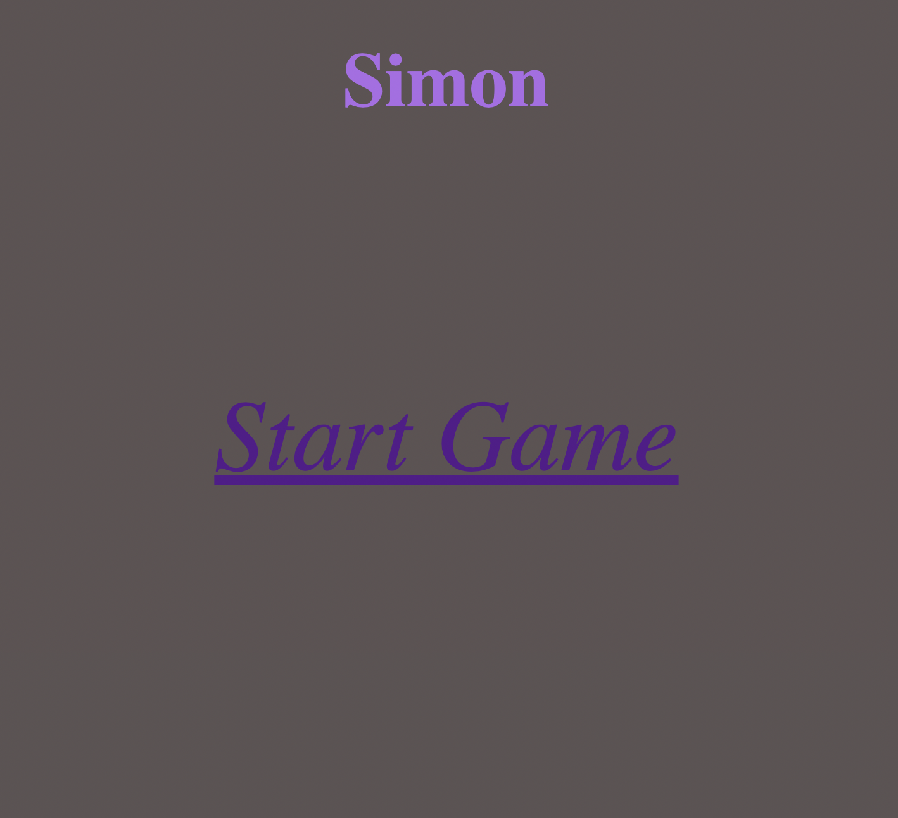
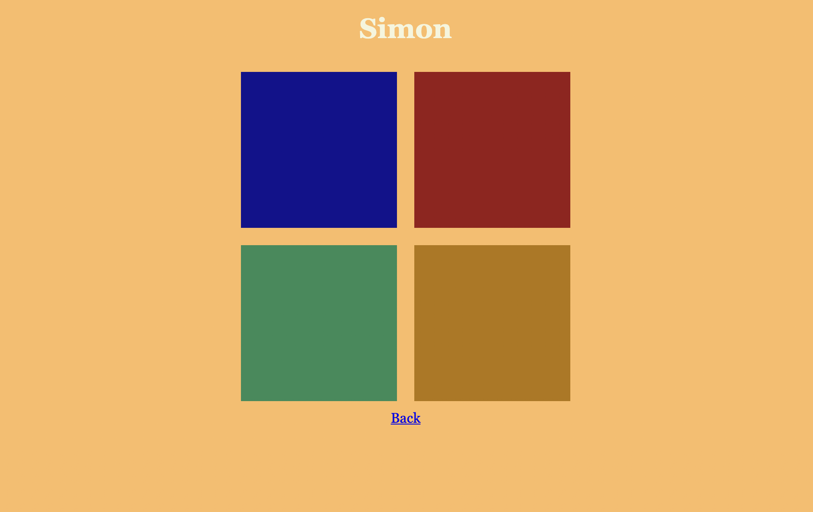
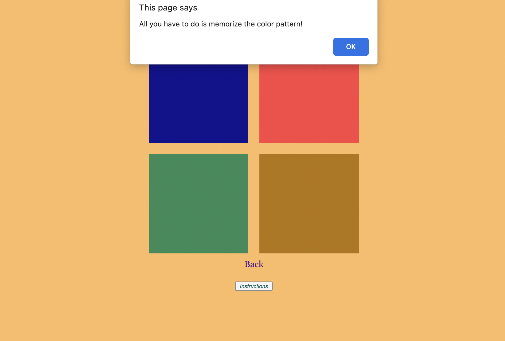
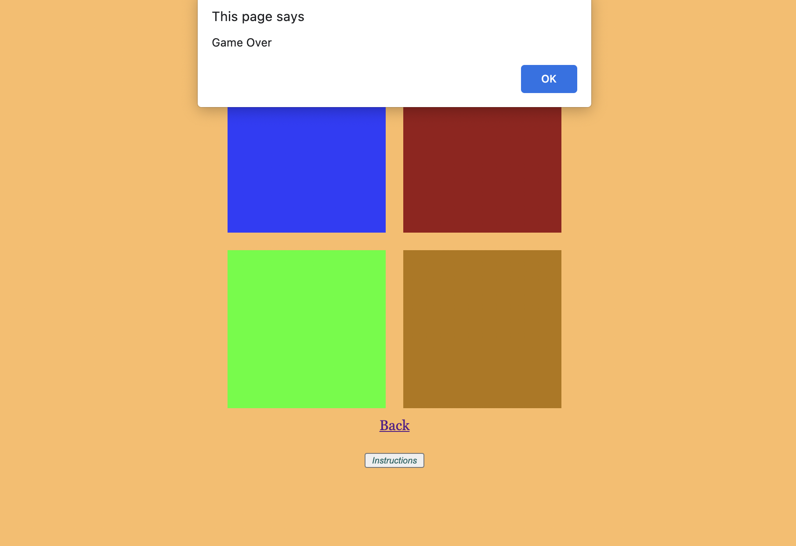

# Simon Says

## Date: 08/13/2021

#### By: Jin Yang Brancalhao

[Trello](https://trello.com/b/kX1IPVxj/design-project-template)

[Git](https://github.com/jinyangb)

[Surge](https://playsimon.surge.sh/index.html)

**_Description_**

Simon says game. It's a game where there is a computer that selects tiles in a certain order and the player has to then select the same tiles in the same order. It is a game of memory that gradually get more difficult as you go.

**_Technologies Used_**

- HTML
- CSS
- JavaScript

**_Getting Started_**

Open game in surge.

**_Screenshots_**

##### start screen

##### gameboard

##### instructions

##### game over

**_Future Updates_**

- [ ] Add sound to tiles
- [x] Instructions Button

**_Credits_**

w2schools
mozilla
